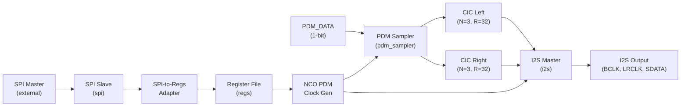
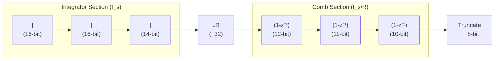

# PDM-to-PCM Converter — Architecture & Programming Reference

**Tiny Tapeout ASIC Design**
**Revision:** 1.0 (VERSION = `0xDA`)
**Top-Level Module:** `tt_um_top`

---

## Table of Contents

1. [Top-Level Architecture & Interconnect](#1-top-level-architecture--interconnect)
   - [1.1 System Overview](#11-system-overview)
   - [1.2 Clock & Reset Scheme](#12-clock--reset-scheme)
   - [1.3 Pin Mapping](#13-pin-mapping)
   - [1.4 Data Flow Pipeline](#14-data-flow-pipeline)
2. [SPI Slave Interface](#2-spi-slave-interface)
   - [2.1 SPI Mode & Protocol](#21-spi-mode--protocol)
   - [2.2 Transaction Protocol](#22-transaction-protocol)
   - [2.3 Timing Constraints](#23-timing-constraints)
3. [Register Map & Reference](#3-register-map--reference)
   - [3.1 Register Summary](#31-register-summary)
   - [3.2 CONTROL (0x00)](#32-control-0x00)
   - [3.3 NCO_CONTROL_LOW (0x01)](#33-nco_control_low-0x01)
   - [3.4 NCO_CONTROL_HIGH (0x02)](#34-nco_control_high-0x02)
   - [3.5 DATA_RIGHT (0x03)](#35-data_right-0x03)
   - [3.6 DATA_LEFT (0x04)](#36-data_left-0x04)
   - [3.7 VERSION (0x05)](#37-version-0x05)
4. [How to Test](#4-how-to-test)
5. [External Hardware](#5-external-hardware)
6. [Functional Block Reference](#6-functional-block-reference)
   - [6.1 PDM Clock Generator (NCO)](#61-pdm-clock-generator-nco)
   - [6.2 PDM Sampler](#62-pdm-sampler)
   - [6.3 CIC Decimation Filter](#63-cic-decimation-filter)
   - [6.4 I2S Master Transmitter](#64-i2s-master-transmitter)

---

## How it works

## 1. Top-Level Architecture & Interconnect

### 1.1 System Overview

The PDM-to-PCM Converter is a fully digital, stereo audio front-end designed for the Tiny Tapeout framework. It accepts a single-bit, time-division-multiplexed Pulse Density Modulation (PDM) stream from a digital MEMS microphone, decimates it through dual-channel Cascaded Integrator-Comb (CIC) filters, and produces a standard I²S stereo PCM output suitable for external audio codecs, DACs, or DSP processors. An SPI slave interface provides register-level control over the internal configuration.

**Key Specifications:**

| Parameter | Value |
|-----------|-------|
| System Clock ($f_{clk}$) | 50 MHz |
| PDM Clock ($f_{pdm}$) | Programmable via NCO (typ. 1–4 MHz) |
| PDM Channels | 2 (stereo, interleaved) |
| CIC Filter Order ($N$) | 3 |
| Decimation Ratio ($R$) | 32 |
| Differential Delay ($M$) | 1 |
| PCM Output Width | 8 bits (per channel) |
| I²S Word Width | 16 bits (8-bit PCM, LSBs zero-padded) |
| I²S Sample Rate | $f_{pdm} / (2 \cdot 32) \approx 0.0156 \cdot f_{pdm}$ |
| Control Interface | SPI Mode 0, 8-bit frame |
| Register Data Width | 8 bits |
| Register Address Width | 3 bits |

The design operates entirely in a single clock domain ($clk$). All internal modules are synchronous and share a common active-low asynchronous reset ($rst\_n$).

### 1.2 Clock & Reset Scheme

#### System Clock ($clk$)

A single 50 MHz external clock drives the entire design. This clock is provided by the Tiny Tapeout carrier board or test harness. The design has no internal PLLs or clock dividers (other than the programmable NCO for PDM clock generation — see Section 6.1).

#### Reset ($rst\_n$)

- **Type:** Asynchronous assertion, synchronous de-assertion (async active-low)
- **Active Level:** Low (`rst_n = 0` asserts reset)
- **Behavior:** All registers, counters, accumulators, and state machines return to their default reset values (see Section 3 for per-register reset values).
- **Recommendation:** Assert $rst\_n$ for a minimum of 16 $clk$ cycles after power-up before beginning SPI transactions.

#### Metastability Protection

SPI input signals (`sck`, `mosi`, `cs_n`) pass through a 2-stage synchronizer chain in `tt_um_top` to mitigate metastability:

```
spi_sck → sck_meta (FF1) → sck (FF2) → internal logic
spi_mosi → mosi_meta (FF1) → mosi (FF2) → internal logic
spi_cs_n → cs_n_meta (FF1) → cs_n (FF2) → internal logic
```

Each synchronizer introduces a 2-cycle latency on SPI inputs.

### 1.3 Pin Mapping

The design is packaged as a Tiny Tapeout 1×2 tile. The following table maps logical signals to physical pins.

#### Dedicated Inputs (`ui_in[7:0]`)

| Pin | Signal | Direction | Description |
|-----|--------|-----------|-------------|
| `ui_in[0]` | `SPI_SCK` | Input | SPI serial clock |
| `ui_in[1]` | `SPI_MOSI` | Input | SPI Master-Out Slave-In |
| `ui_in[2]` | `SPI_CS_N` | Input | SPI chip select (active low) |
| `ui_in[3]` | `PDM_DATA` | Input | Single-bit PDM data stream |
| `ui_in[7:4]` | — | — | Unused, tie to GND |

#### Dedicated Outputs (`uo_out[7:0]`)

| Pin | Signal | Direction | Description |
|-----|--------|-----------|-------------|
| `uo_out[0]` | `PDM_CLK` | Output | PDM clock to microphone |
| `uo_out[1]` | `I2S_BCLK` | Output | I²S serial bit clock |
| `uo_out[2]` | `I2S_LRCLK` | Output | I²S word select (0=left, 1=right) |
| `uo_out[3]` | `I2S_SDATA` | Output | I²S serial data |
| `uo_out[7:4]` | — | Output | Tied to `0` |

#### Bidirectional I/O (`uio[7:0]`)

| Pin | Signal | Direction | Description |
|-----|--------|-----------|-------------|
| `uio[0]` | `SPI_MISO` | Output (when `cs_n`=0) | SPI Master-In Slave-Out |
| `uio[7:1]` | — | — | Unused, output low, input disabled |

> **Note:** `uio_oe[0]` is driven by `~cs_n`, so the MISO line is only actively driven when the chip is selected. When `cs_n` is high (deselected), the MISO pin is high-impedance (tri-state).

### 1.4 Data Flow Pipeline

The signal processing chain is illustrated below. Data flows left-to-right through four sequential stages:



#### Stage 1 — PDM Interface

The `pdm_sampler` module receives a single-bit PDM stream on `pdm_data`. Using the internally generated PDM clock edges (`pdm_clk_re` / `pdm_clk_fe`), it demultiplexes the interleaved stereo data: samples captured on the **rising edge** of `pdm_clk` are assigned to the **left channel**, and samples captured on the **falling edge** are assigned to the **right channel**. Each per-channel output is a 1-bit signal accompanied by a single-cycle valid strobe.

#### Stage 2 — CIC Decimation

Two identical third-order ($N=3$) CIC decimation filters (`cic`) process the left and right channels independently. Each filter:

- Accumulates 1-bit PDM samples (mapped to ±1) through three integrator stages.
- Decimates by $R=32$: the comb stages fire once every 32 valid input samples.
- Applies three comb stages with differential delay $M=1$.
- Truncates the final output to 8 bits.

The output sample rate per channel is:

$$
f_{pcm} = \frac{f_{pdm}}{2 \cdot 32} = \frac{f_{pdm}}{64}
$$

For a typical PDM clock of 1.024 MHz, the PCM output rate is 16 kHz per channel.

#### Stage 3 — I²S Master

The `i2s` module receives 8-bit PCM data from both CIC filters and formats it into a standard I²S stereo stream with 16-bit word width. The 8-bit PCM samples are left-aligned within the 16-bit I²S word (bits [15:8] carry the PCM value; bits [7:0] are zero). The module generates `bclk` (equal to `pdm_clk`), `lrclk` (frame sync), and `sdata` (serial data) for direct connection to an external I²S device.

#### Stage 4 — Output Pins

The I²S and PDM clock signals are routed to `uo_out[3:0]` on the Tiny Tapeout package.

#### Control Path (SPI)

In parallel with the data path, an SPI slave (`spi`) receives configuration commands from an external master. The `spi_to_regs_adapter` translates the 2-byte SPI protocol into register read/write requests. The `regs` module stores the control and NCO configuration fields and exposes read-only PCM data and version information.

---

## 2. SPI Slave Interface

### 2.1 SPI Mode & Protocol

The SPI slave operates in **SPI Mode 0** with the following characteristics:

| Parameter | Value |
|-----------|-------|
| **CPOL** (Clock Polarity) | 0 — SCK idles low |
| **CPHA** (Clock Phase) | 0 — Data sampled on SCK rising edge, shifted out on SCK falling edge |
| **Bit Order** | MSB first |
| **Word Size** | 8 bits per byte |
| **Duplex** | Full-duplex (simultaneous MOSI and MISO transfer) |
| **Chip Select** | Active low (`cs_n = 0`) |

**Timing Diagram (CPOL=0, CPHA=0):**

```
CS_N  \___________________________/~~~~
       ‾‾‾‾‾‾‾‾‾‾‾‾‾‾‾‾‾‾‾‾‾‾‾‾‾‾‾
SCK   ‾‾\___/‾‾‾\___/‾‾‾\___/‾‾‾\___
           ↓R        ↓R        ↓R
MOSI  ----< MSB >---<  6 >---<  5 >---...
MISO  ----< MSB >---<  6 >---<  5 >---...
           ↑F        ↑F        ↑F
```
> R = Rising edge (sample), F = Falling edge (shift)

- **MOSI Capture:** On every SCK rising edge, the MOSI bit is shifted into an 8-bit receive shift register (LSB direction).
- **MISO Drive:** The MSB of the MISO shift register is continuously output on the `miso` pin. On every SCK falling edge when the internal bit counter is zero, a new byte is loaded from the response buffer. On subsequent falling edges, the MISO shift register shifts left (toward MSB), driving the next bit.

### 2.2 Transaction Protocol

All SPI transactions consist of exactly **2 bytes** (16 SCK cycles). The `spi_to_regs_adapter` toggles an internal `byte_sel` flag on each received byte to distinguish command/address bytes from data bytes.

#### Write Transaction

| Byte | Field | Bit [7:5] | Bit [4] | Bit [3] | Bits [2:0] |
|------|-------|-----------|---------|---------|------------|
| **0** | Command/Address | `3'b000` | `1` (Write) | Reserved (`0`) | Register Address |
| **1** | Write Data | | `data[7:0]` | | |

**Write Sequence:**
1. Master sends Byte 0: `{3'b000, 1'b1, 1'b0, addr[2:0]}` — the device latches the target address. No register access occurs yet.
2. Master sends Byte 1: `data[7:0]` — the 8-bit value is written to the addressed register. The write takes effect at the end of Byte 1.

#### Read Transaction

| Byte | Field | Bit [7:5] | Bit [4] | Bit [3] | Bits [2:0] |
|------|-------|-----------|---------|---------|------------|
| **0** | Command/Address | `3'b000` | `0` (Read) | Reserved (`0`) | Register Address |
| **1** | Dummy / Next Cmd | | Don't care | | |

**Read Sequence:**

1. Master sends Byte 0: `{3'b000, 1'b0, 1'b0, addr[2:0]}` — the device decodes the read command and address.
2. Master sends Byte 1: any 8-bit value (don't care). The read data is returned on MISO during Byte 1.

### 2.3 Timing Constraints

| Parameter | Value |
|-----------|-------|
| Maximum SCK frequency | $f_{clk} / 4$ (12.5 MHz at 50 MHz system clock) |
| Recommended SCK frequency | ~1 MHz |

> $f_{clk} = 50\text{ MHz}$, $t_{clk} = 20\text{ ns}$.

The maximum SCK frequency is limited by the 2-stage synchronizer chain on the SPI inputs (SCK, MOSI, CS_N).

---

## 3. Register Map & Reference

### 3.1 Register Summary

| Address | Name | Type | Width | Reset Value | Description |
|---------|------|------|-------|-------------|-------------|
| `0x00` | `CONTROL` | RW | 8 | `0x00` | Global enable and control |
| `0x01` | `NCO_CONTROL_LOW` | RW | 8 | `0x00` | NCO step value, lower byte |
| `0x02` | `NCO_CONTROL_HIGH` | RW | 8 | `0x00` | NCO step value, upper byte |
| `0x03` | `DATA_RIGHT` | RO | 8 | `0x00` | Right-channel PCM sample |
| `0x04` | `DATA_LEFT` | RO | 8 | `0x00` | Left-channel PCM sample |
| `0x05` | `VERSION` | RO | 8 | `0xDA` | Hardware version identifier |
| `0x06`–`0x07` | — | — | — | `0x00` | Reserved (returns `0x00`) |

> **Type Key:** RO = Read-Only, RW = Read-Write, WO = Write-Only

### 3.2 CONTROL (`0x00`)

**Address:** `0x00`
**Type:** Read-Write (RW)
**Reset Value:** `0x00`

The CONTROL register governs the master enable for the PDM-to-PCM conversion pipeline and provides expansion fields for future use.

| Bit(s) | Field Name | Access | Reset | Description |
|--------|-----------|--------|-------|-------------|
| **0** | `enable` | RW | `0` | **Global Enable.** When `1`, the NCO-based PDM clock generator runs and the entire conversion pipeline is active. When `0`, the PDM clock generator is gated (accumulator frozen, `pdm_clk` held steady), the CIC integrators stop accumulating, and the I²S transmitter halts. |
| `[7:1]` | — | — | `7'b0000000` | **Reserved.** Writes are ignored; reads return `0`. |

**Usage Notes:**
- After reset, write `0x01` to address `0x00` to enable the converter.
- To disable, write `0x00`. The pipeline stops within one clock cycle.

### 3.3 NCO_CONTROL_LOW (`0x01`)

**Address:** `0x01`
**Type:** Read-Write (RW)
**Reset Value:** `0x00`

| Bit(s) | Field Name | Access | Reset | Description |
|--------|-----------|--------|-------|-------------|
| `[7:0]` | `nco_control_low` | RW | `0x00` | Lower 8 bits of the 16-bit NCO step value. Combined with `NCO_CONTROL_HIGH` to form `step[15:0]`. |

### 3.4 NCO_CONTROL_HIGH (`0x02`)

**Address:** `0x02`
**Type:** Read-Write (RW)
**Reset Value:** `0x00`

| Bit(s) | Field Name | Access | Reset | Description |
|--------|-----------|--------|-------|-------------|
| `[7:0]` | `nco_control_high` | RW | `0x00` | Upper 8 bits of the 16-bit NCO step value. |

**16-Bit Step Formation:**

$$
\text{step}[15:0] = \{\,\text{NCO\_CONTROL\_HIGH}[7:0],\; \text{NCO\_CONTROL\_LOW}[7:0]\,\}
$$

**PDM Clock Frequency Calculation:**

The NCO accumulator width is $N=16$ bits. The PDM clock is generated by toggling a register on every accumulator overflow:

$$
f_{pdm} = \frac{f_{clk} \cdot \text{step}}{2^{17}} = \frac{50 \times 10^6 \cdot \text{step}}{131072}
$$

**Common Configuration Examples (at $f_{clk}=50$ MHz):**

| $f_{pdm}$ (MHz) | step (decimal) | step (hex) | NCO_CONTROL_HIGH | NCO_CONTROL_LOW |
|------------------|----------------|------------|-------------------|------------------|
| 0.768 | 2013 | `0x07DD` | `0x07` | `0xDD` |
| 1.024 | 2684 | `0x0A7C` | `0x0A` | `0x7C` |
| 1.536 | 4027 | `0x0FBB` | `0x0F` | `0xBB` |
| 2.048 | 5369 | `0x14F9` | `0x14` | `0xF9` |
| 2.400 | 6291 | `0x1893` | `0x18` | `0x93` |
| 3.072 | 8053 | `0x1F75` | `0x1F` | `0x75` |
| 4.096 | 10737 | `0x29F1` | `0x29` | `0xF1` |

**Recommended Procedure:**
1. Write `NCO_CONTROL_LOW` first (address `0x01`).
2. Write `NCO_CONTROL_HIGH` second (address `0x02`).
3. The NCO step updates immediately on the write to `0x02`.
4. Finally, set `CONTROL.enable = 1` (address `0x00`) to start the PDM clock.

> ⚠️ **Caution:** Writing `step = 0` will freeze the PDM clock. The minimum practical step value is `1`, producing $f_{pdm} \approx 381.5$ Hz.

### 3.5 DATA_RIGHT (`0x03`)

**Address:** `0x03`
**Type:** Read-Only (RO)
**Reset Value:** `0x00`

| Bit(s) | Field Name | Access | Reset | Description |
|--------|-----------|--------|-------|-------------|
| `[7:0]` | `data_right` | RO | `0x00` | Most recent 8-bit PCM sample from the **right-channel** CIC decimation filter. Value is signed two's complement. Updated once every 64 PDM clock cycles (at $f_{pcm}$). |

**Interpretation:**
- Data is **signed 8-bit** (two's complement).
- `0x00` = zero (silence).
- `0x7F` = +127 (maximum positive amplitude).
- `0x80` = −128 (maximum negative amplitude).
- The value represents the decimated and filtered PDM density, proportional to the analog sound pressure level at the microphone.

### 3.6 DATA_LEFT (`0x04`)

**Address:** `0x04`
**Type:** Read-Only (RO)
**Reset Value:** `0x00`

| Bit(s) | Field Name | Access | Reset | Description |
|--------|-----------|--------|-------|-------------|
| `[7:0]` | `data_left` | RO | `0x00` | Most recent 8-bit PCM sample from the **left-channel** CIC decimation filter. Identical format to `DATA_RIGHT`. Updated once every 64 PDM clock cycles, offset from the right channel by one half PDM clock period. |

### 3.7 VERSION (`0x05`)

**Address:** `0x05`
**Type:** Read-Only (RO)
**Reset Value:** `0xDA`

| Bit(s) | Field Name | Access | Reset | Description |
|--------|-----------|--------|-------|-------------|
| `[7:0]` | `version` | RO | `0xDA` | Hardware version identifier. Hard-coded to `0xDA`. This register can be used by driver software to verify communication with the device and detect the silicon revision. |

---

## How to Test

### Physical Setup

1. **Connect a PDM MEMS microphone** (e.g., Knowles SPH0641LU, InvenSense ICS-43432, or ST MP34DT05) to the Tiny Tapeout board:
   - Microphone **DATA** pin → `ui_in[3]` (PDM_DATA)
   - Microphone **CLK** pin ← `uo_out[0]` (PDM_CLK)
   - Microphone **L/R** pin → GND (left channel) or VDD (right channel)
   - Provide appropriate VDD (typically 3.3V or 1.8V per microphone datasheet) and GND.

2. **Connect an SPI master** (e.g., Raspberry Pi, Arduino, FTDI FT232H) to the SPI pins:
   - `ui_in[0]` ← SPI SCK
   - `ui_in[1]` ← SPI MOSI
   - `ui_in[2]` ← SPI CS_N
   - `uio[0]` → SPI MISO

3. **Optionally, connect an I²S receiver** (e.g., DAC, audio codec, or logic analyzer) to:
   - `uo_out[1]` → I2S_BCLK
   - `uo_out[2]` → I2S_LRCLK
   - `uo_out[3]` → I2S_SDATA

### Power-Up Sequence

1. Apply 50 MHz clock to `clk`.
2. Assert `rst_n = 0` for ≥16 clock cycles (320 ns).
3. De-assert `rst_n = 1`.
4. Read `VERSION` register (`SPI Read 0x05`) to verify communication. Expected response: `0xDA`.
5. Configure PDM clock frequency by writing `NCO_CONTROL_LOW` and `NCO_CONTROL_HIGH`.
6. Set `CONTROL.enable = 1`.
7. Poll `DATA_LEFT` and `DATA_RIGHT` or capture I²S output.

### Minimal Python Example

```python
import spidev

spi = spidev.SpiDev()
spi.open(0, 0)
spi.mode = 0              # CPOL=0, CPHA=0
spi.max_speed_hz = 1000000
spi.bits_per_word = 8

def read_reg(addr):
    """Read a single register. Returns the 8-bit register value."""
    cmd = (addr & 0x07) | 0x00  # bit[4]=0 for read
    _, data = spi.xfer2([cmd, 0x00])
    return data

def write_reg(addr, data):
    """Write a single register (takes effect immediately)."""
    cmd = (addr & 0x07) | 0x10  # bit[4]=1 for write
    spi.xfer2([cmd, data])

# Verify communication
version = read_reg(0x05)
print(f"VERSION: 0x{version:02X}")  # Expected: 0xDA

# Configure for 1.024 MHz PDM clock
write_reg(0x01, 0x7C)  # NCO_CONTROL_LOW
write_reg(0x02, 0x0A)  # NCO_CONTROL_HIGH

# Enable converter
write_reg(0x00, 0x01)  # CONTROL.enable = 1

# Read PCM data
while True:
    right = read_reg(0x03)
    left  = read_reg(0x04)
    print(f"Left: {left:4d}  Right: {right:4d}")
```

### Verification

- **Register Readback:** Read back `CONTROL`, `NCO_CONTROL_LOW`, and `NCO_CONTROL_HIGH` after writing. Values should match.
- **I²S Output:** With a 1.024 MHz PDM clock, expect:
  - `I2S_BCLK` = 1.024 MHz
  - `I2S_LRCLK` = 16 kHz
  - 16-bit I²S frames with PCM data in the upper byte
- **PDM Clock:** Measure `uo_out[0]` with an oscilloscope or frequency counter.

---

## 5. External Hardware

The design requires the following external components:

| Component | Quantity | Part Examples | Purpose |
|-----------|----------|---------------|---------|
| **PDM MEMS Microphone** | 1 | Knowles SPH0641LU4-1, InvenSense ICS-43432, ST MP34DT05 | Provides the single-bit PDM audio stream. The microphone's L/R select pin should be tied to GND for left-channel operation. |
| **SPI Master MCU** | 1 | Raspberry Pi, Arduino, ESP32, FTDI FT232H | Configures the converter via SPI. Must support SPI Mode 0 at ≤12.5 MHz. |
| **I²S DAC / Audio Codec** (optional) | 1 | PCM5102A, MAX98357A, UDA1334A | Receives the I²S PCM stream for analog audio output or further DSP processing. |
| **Logic Analyzer** (optional) | 1 | Saleae, DSLogic | For debugging I²S timing and SPI transactions. |

No additional passive components are required for the digital interface. The microphone's power supply decoupling (typically 100 nF + 10 µF bypass capacitors) should be provided according to the microphone datasheet.

**PDM Microphone Wiring:**

```
Microphone        Tiny Tapeout
-----------       ------------
VDD         →     3.3V (external)
GND         →     GND (external)
SELECT      →     GND (for left channel) or VDD (for right)
DATA        →     ui_in[3] (PDM_DATA)
CLK         ←     uo_out[0] (PDM_CLK)
```

---

## 6. Functional Block Reference

### 6.1 PDM Clock Generator (NCO)

**Module:** `pdm_clk_gen`
**Source:** `src/pdm_clk_gen.sv`

The PDM clock generator uses a Numerically Controlled Oscillator (NCO) architecture to derive a programmable PDM clock frequency from the fixed 50 MHz system clock.

**Architecture:**

```
       ┌──────────┐     carry      ┌──────────┐
step →│ 16-bit   │───────────────→│ Toggle   │→ pdm_clk_reg
      │ Adder    │                 │ Flip-Flop│
      └────┬─────┘                 └────┬─────┘
           │                            │
      ┌────▼─────┐                 ┌────▼─────┐
      │ acc[15:0]│                 │ Edge     │→ pdm_clk_re
      │ Register │                 │ Detector │→ pdm_clk_fe
      └──────────┘                 └──────────┘
```

**Key Parameters:**

| Parameter | Value | Description |
|-----------|-------|-------------|
| $N$ | 16 | Accumulator bit width |
| $f_{clk}$ | 50 MHz | System clock |
| `enable` | `CONTROL[0]` | Gated by global enable |

**Frequency Resolution:**

$$
\Delta f_{pdm} = \frac{f_{clk}}{2^{17}} = \frac{50 \times 10^6}{131072} \approx 381.5 \text{ Hz}
$$

**Output Enable Gating:** When `enable = 0`, the accumulator and carry logic are frozen. The `pdm_clk` output holds its last value.

### 6.2 PDM Sampler

**Module:** `pdm_sampler`
**Source:** `src/pdm_sampler.sv`

The PDM sampler demultiplexes a single interleaved stereo PDM stream into separate left and right channels based on the PDM clock phase.

**Operation:**

| PDM Clock Edge | Captured Channel | Output Strobe |
|----------------|------------------|---------------|
| Rising (`pdm_clk_re`) | **Left** | `pdm_data_left_valid = 1` |
| Falling (`pdm_clk_fe`) | **Right** | `pdm_data_right_valid = 1` |

This scheme is compatible with standard MEMS microphones that output left-channel data on the rising edge of the PDM clock and right-channel data on the falling edge (when the L/R select pin is configured appropriately). Note that the actual L/R assignment of the physical microphone depends on the state of its SELECT pin; the design captures rising-edge samples as "left" and falling-edge samples as "right."

### 6.3 CIC Decimation Filter

**Module:** `cic`
**Source:** `src/cic.sv`

The CIC (Cascaded Integrator-Comb) filter is a computationally efficient multi-rate filter structure well-suited for sigma-delta (PDM) decimation. It requires no multipliers — only adders and registers.

**Filter Specifications:**

| Parameter | Symbol | Value |
|-----------|--------|-------|
| Order | $N$ | 3 |
| Decimation Ratio | $R$ | 32 |
| Differential Delay | $M$ | 1 |
| Input Width | $B_{in}$ | 1 bit |
| Output Width | $B_{out}$ | 8 bits |
| Maximum Accumulator Width | | 16 bits |

**Architecture (Hogenauer structure):**



**Bipolar Mapping (PDM to Signed):**

PDM input `1` maps to `+1`, PDM input `0` maps to `-1`.

**Frequency Response:** The $z$-domain transfer function of the CIC filter is:

$$
H(z) = \left(\frac{1 - z^{-RM}}{1 - z^{-1}}\right)^N = \left(\frac{1 - z^{-32}}{1 - z^{-1}}\right)^3
$$

### 6.4 I²S Master Transmitter

**Module:** `i2s`
**Source:** `src/i2s.sv`

The I²S master transmitter formats the 8-bit PCM samples into a standard I²S stereo stream and generates all required clock and sync signals.

**I²S Bus Configuration:**

| Parameter | Value |
|-----------|-------|
| Word Width | 16 bits per channel |
| Channel Count | 2 (stereo: left, right) |
| Audio Data Width | 8 bits (left-aligned, bits [7:0] zero) |
| LRCLK Polarity | `0` = Left channel, `1` = Right channel |
| BCLK | Equal to `pdm_clk` (gated by `ready`) |
| Data Change | On BCLK falling edge |
| Data Latch (receiver side) | On BCLK rising edge |

**I²S Frame Format:**

```
BCLK   _/‾\_/‾\_/‾\_/‾\_/‾\ ... /‾\_/‾\_/‾\_/‾\_/‾\_ ... /‾\_/‾\
LRCLK  ‾‾‾‾‾‾‾‾‾‾‾‾‾‾‾‾‾‾‾‾‾‾‾‾‾\_________________________/
        ← Left Channel (16 BCLK) →← Right Channel (16 BCLK) →
SDATA  --<15><14>...<8><0>...<0>--<15><14>...<8><0>...<0>--
        ← MSB             LSB →  ← MSB             LSB →
```

The transmitter begins output once the first valid PCM sample arrives. PCM data is captured into shadow registers on each channel's valid strobe and transferred to the shift register at the appropriate LRCLK boundary. BCLK is gated by an internal `ready` flag and held low before the first sample arrives. LRCLK alternates every 16 BCLK cycles.

---

*For hardware details, see `src/rtl/src/` and the Tiny Tapeout datasheet.*
