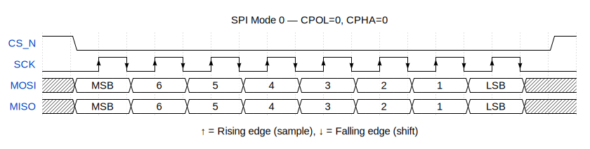
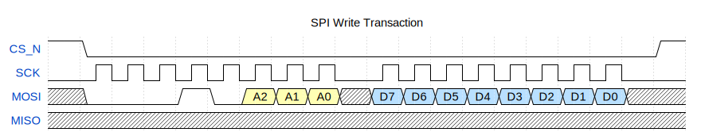
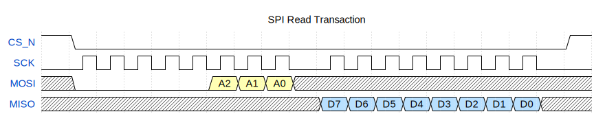
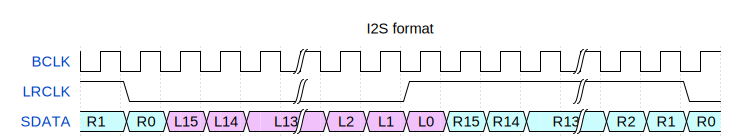

<!---

This file is used to generate your project datasheet. Please fill in the information below and delete any unused
sections.

You can also include images in this folder and reference them in the markdown. Each image must be less than
512 kb in size, and the combined size of all images must be less than 1 MB.
-->

## How it works

The PDM-to-PCM Converter accepts a stereo Pulse Density Modulation (PDM) stream from a digital MEMS microphone, decimates it through dual-channel Cascaded Integrator-Comb (CIC) filters, and outputs standard I²S stereo PCM audio. An SPI slave interface (Mode 0) provides register-level control over the PDM clock frequency and converter enable.

**Key Specifications:**

| Parameter | Value |
|-----------|-------|
| System Clock ($f_{clk}$) | 50 MHz |
| PDM Clock ($f_{pdm}$) | Programmable via NCO (typ. 1–4 MHz) |
| PDM Channels | 2 (stereo, interleaved) |
| CIC Filter Order ($N$) | 3 |
| Decimation Ratio ($R$) | 32 |
| Differential Delay ($M$) | 1 |
| PCM Output Width | 8 bits (per channel) |
| I²S Word Width | 16 bits (8-bit PCM, LSBs zero-padded) |
| I²S Sample Rate | $f_{pdm} / 32 \approx 0.03125 \cdot f_{pdm}$ |
| Control Interface | SPI Mode 0, 8-bit frame |
| Register Data Width | 8 bits |
| Register Address Width | 3 bits |

### 1. Architecture

#### 1.1 System Overview

The PDM-to-PCM Converter is a fully digital, stereo audio front-end designed for the Tiny Tapeout framework. It accepts a single-bit, time-division-multiplexed Pulse Density Modulation (PDM) stream from a digital MEMS microphone, decimates it through dual-channel Cascaded Integrator-Comb (CIC) filters, and produces a standard I²S stereo PCM output suitable for external audio codecs, DACs, or DSP processors. An SPI slave interface provides register-level control over the internal configuration.

The design operates entirely in a single clock domain ($clk$). All internal modules are synchronous and share a common active-low asynchronous reset ($rst\_n$).

#### 1.2 Clock & Reset Scheme

**System Clock ($clk$)**

A single 50 MHz external clock drives the entire design. This clock is provided by the Tiny Tapeout carrier board or test harness. The design has no internal PLLs or clock dividers (other than the programmable NCO for PDM clock generation).

**Reset ($rst\_n$)**

- **Type:** Asynchronous assertion, synchronous de-assertion (async active-low)
- **Active Level:** Low (`rst_n = 0` asserts reset)
- **Behavior:** All registers, counters, and accumulators return to their default reset values.
- **Recommendation:** Assert $rst\_n$ for a minimum of 16 $clk$ cycles after power-up before beginning SPI transactions.

**Metastability Protection**

SPI input signals (`sck`, `mosi`, `cs_n`) pass through a 2-stage synchronizer chain in `tt_um_top` to mitigate metastability. Each synchronizer introduces a 2-cycle latency on SPI inputs.

#### 1.3 Pin Mapping

The design is packaged as a Tiny Tapeout 1×2 tile. The following tables map logical signals to physical pins.

**Dedicated Inputs (`ui_in[7:0]`)**

| Pin | Signal | Direction | Description |
|-----|--------|-----------|-------------|
| `ui_in[0]` | `SPI_SCK` | Input | SPI serial clock |
| `ui_in[1]` | `SPI_MOSI` | Input | SPI Master-Out Slave-In |
| `ui_in[2]` | `SPI_CS_N` | Input | SPI chip select (active low) |
| `ui_in[3]` | `PDM_DATA` | Input | Single-bit PDM data stream |
| `ui_in[7:4]` | — | — | Unused |

**Dedicated Outputs (`uo_out[7:0]`)**

| Pin | Signal | Direction | Description |
|-----|--------|-----------|-------------|
| `uo_out[0]` | `PDM_CLK` | Output | PDM clock to microphone |
| `uo_out[1]` | `I2S_BCLK` | Output | I²S serial bit clock |
| `uo_out[2]` | `I2S_LRCLK` | Output | I²S word select (0=left, 1=right) |
| `uo_out[3]` | `I2S_SDATA` | Output | I²S serial data |
| `uo_out[7:4]` | — | Output | Tied to `0` |

**Bidirectional I/O (`uio[7:0]`)**

| Pin | Signal | Direction | Description |
|-----|--------|-----------|-------------|
| `uio[0]` | `SPI_MISO` | Output (when `cs_n`=0) | SPI Master-In Slave-Out |
| `uio[7:1]` | — | — | Unused, output low, input disabled |

> **Note:** `uio_oe[0]` is driven by `~cs_n`, so the MISO line is only actively driven when the chip is selected. When `cs_n` is high (deselected), the MISO pin is high-impedance (tri-state).

#### 1.4 Data Flow Pipeline

The signal processing chain flows through four sequential stages:


**Stage 1 — PDM Interface:** The `pdm_clk_gen` module generates the programmable PDM clock from the 50 MHz system clock using an NCO-based architecture. The `pdm_sampler` module receives the single-bit PDM stream on `pdm_data`. Using the PDM clock edges from `pdm_clk_gen`, it demultiplexes the interleaved stereo data: samples captured on the **rising edge** of `pdm_clk` are assigned to the **left channel**, and samples captured on the **falling edge** are assigned to the **right channel**. Each per-channel output is a 1-bit signal accompanied by a single-cycle valid strobe.

**Stage 2 — CIC Decimation:** Two identical third-order ($N=3$) CIC decimation filters process the left and right channels independently. Each filter accumulates 1-bit PDM samples (mapped to ±1) through three integrator stages, decimates by $R=32$, applies three comb stages with differential delay $M=1$, and truncates the final output to 8 bits. The output sample rate per channel is:

$$
f_{pcm} = \frac{f_{pdm}}{32}
$$

For a typical PDM clock of 1.024 MHz, the PCM output rate is 32 kHz per channel.

**Stage 3 — I²S Master:** The `i2s` module receives 8-bit PCM data from both CIC filters and formats it into a standard I²S stereo stream with 16-bit word width. The 8-bit PCM samples are left-aligned within the 16-bit I²S word (bits [15:8] carry the PCM value; bits [7:0] are zero). The module generates `bclk` (equal to `pdm_clk`), `lrclk` (frame sync), and `sdata`.

**Stage 4 — Output Pins:** The I²S and PDM clock signals are routed to `uo_out[3:0]` on the Tiny Tapeout package.

**Control Path (SPI):** In parallel with the data path, an SPI slave receives configuration commands from an external master. The `spi_to_regs_adapter` translates the 2-byte SPI protocol into register read/write requests. The `regs` module stores the control and NCO configuration fields and exposes read-only PCM data and version information.

### 2. SPI Control Interface

#### 2.1 SPI Mode & Protocol

The SPI slave operates in **SPI Mode 0** with the following characteristics:

| Parameter | Value |
|-----------|-------|
| **CPOL** (Clock Polarity) | 0 — SCK idles low |
| **CPHA** (Clock Phase) | 0 — Data sampled on SCK rising edge, shifted out on SCK falling edge |
| **Bit Order** | MSB first |
| **Word Size** | 8 bits per byte |
| **Duplex** | Full-duplex (simultaneous MOSI and MISO transfer) |
| **Chip Select** | Active low (`cs_n = 0`) |

**Timing Diagram (CPOL=0, CPHA=0):**



- **MOSI Capture:** On every SCK rising edge, the MOSI bit is shifted into an 8-bit receive shift register.
- **MISO Drive:** On every SCK falling edge, the MSB of the MISO shift out from the 8-bit transmit register.

#### 2.2 Transaction Protocol

All SPI transactions consist of exactly **2 bytes** (16 SCK cycles).

**Write Transaction**

| Byte | Field | Bit [7:5] | Bit [4] | Bit [3] | Bits [2:0] |
|------|-------|-----------|---------|---------|------------|
| **0** | Command/Address | `3'b000` | `1` (Write) | Reserved (`0`) | Register Address |
| **1** | Write Data | | `data[7:0]` | | |

1. Master sends Byte 0: `{3'b000, 1'b1, 1'b0, addr[2:0]}` — the device latches the target address.
2. Master sends Byte 1: `data[7:0]` — the 8-bit value is written to the addressed register.



**Read Transaction**

| Byte | Field | Bit [7:5] | Bit [4] | Bit [3] | Bits [2:0] |
|------|-------|-----------|---------|---------|------------|
| **0** | Command/Address | `3'b000` | `0` (Read) | Reserved (`0`) | Register Address |
| **1** | Dummy / Next Cmd | | Don't care | | |

1. Master sends Byte 0: `{3'b000, 1'b0, 1'b0, addr[2:0]}` — the device decodes the read command and address.
2. Master sends Byte 1: any 8-bit value (don't care). The read data is returned on MISO during Byte 1.



#### 2.3 Timing Constraints

| Parameter | Value |
|-----------|-------|
| Maximum SCK frequency | $f_{clk} / 4$ (12.5 MHz at 50 MHz system clock) |
| Recommended SCK frequency | ~1 MHz |

The maximum SCK frequency is limited by the 2-stage synchronizer chain on the SPI inputs (SCK, MOSI, CS_N).

### 3. Register Map

#### 3.1 Register Summary

| Address | Name | Type | Width | Reset Value | Description |
|---------|------|------|-------|-------------|-------------|
| `0x00` | `CONTROL` | RW | 8 | `0x00` | Global enable and control |
| `0x01` | `NCO_CONTROL_LOW` | RW | 8 | `0x00` | NCO step value, lower byte |
| `0x02` | `NCO_CONTROL_HIGH` | RW | 8 | `0x00` | NCO step value, upper byte |
| `0x03` | `DATA_RIGHT` | RO | 8 | `0x00` | Right-channel PCM sample |
| `0x04` | `DATA_LEFT` | RO | 8 | `0x00` | Left-channel PCM sample |
| `0x05` | `VERSION` | RO | 8 | `0xDA` | Hardware version identifier |
| `0x06`–`0x07` | — | — | — | `0x00` | Reserved (returns `0x00`) |

> **Type Key:** RO = Read-Only, RW = Read-Write

#### 3.2 CONTROL (`0x00`)

**Type:** Read-Write (RW) — **Reset:** `0x00`

| Bit(s) | Field Name | Access | Reset | Description |
|--------|-----------|--------|-------|-------------|
| **0** | `enable` | RW | `0` | **Global Enable.** When `1`, the NCO-based PDM clock generator runs and the entire conversion pipeline is active. When `0`, the PDM clock generator is gated (accumulator frozen, `pdm_clk` held steady), the CIC integrators stop accumulating, and the I²S transmitter halts. |
| `[7:1]` | — | — | `7'b0000000` | **Reserved.** Writes are ignored; reads return `0`. |

**Usage Notes:**
- After reset, write `0x01` to address `0x00` to enable the converter.
- To disable, write `0x00`. The pipeline stops within one clock cycle.

#### 3.3 NCO_CONTROL_LOW (`0x01`)

**Type:** Read-Write (RW) — **Reset:** `0x00`

| Bit(s) | Field Name | Access | Reset | Description |
|--------|-----------|--------|-------|-------------|
| `[7:0]` | `nco_control_low` | RW | `0x00` | Lower 8 bits of the 16-bit NCO step value. Combined with `NCO_CONTROL_HIGH` to form `step[15:0]`. |

#### 3.4 NCO_CONTROL_HIGH (`0x02`)

**Type:** Read-Write (RW) — **Reset:** `0x00`

| Bit(s) | Field Name | Access | Reset | Description |
|--------|-----------|--------|-------|-------------|
| `[7:0]` | `nco_control_high` | RW | `0x00` | Upper 8 bits of the 16-bit NCO step value. |

**16-Bit Step Formation:**

$$
\text{step}[15:0] = \{\,\text{NCO\_CONTROL\_HIGH}[7:0],\; \text{NCO\_CONTROL\_LOW}[7:0]\,\}
$$

**PDM Clock Frequency Calculation:**

$$
f_{pdm} = \frac{f_{clk} \cdot \text{step}}{2^{17}} = \frac{50 \times 10^6 \cdot \text{step}}{131072}
$$

Which can be rearranged to solve for the required NCO step value given a desired PDM clock frequency:

$$
\text{step} = \frac{f_{pdm} \cdot 2^{17}}{f_{clk}} = \frac{f_{pdm} \cdot 131072}{50 \times 10^6}
$$

**Common Configuration Examples (at $f_{clk}=50$ MHz):**

| $f_{pdm}$ (MHz) | I²S Sample Rate | step (decimal) | step (hex) | NCO_CONTROL_HIGH | NCO_CONTROL_LOW |
|------------------|-----------------|----------------|------------|-------------------|-------------------|
| 0.768 | 24 kHz | 2013 | `0x07DD` | `0x07` | `0xDD` |
| 1.024 | 32 kHz | 2684 | `0x0A7C` | `0x0A` | `0x7C` |
| 1.536 | 48 kHz | 4027 | `0x0FBB` | `0x0F` | `0xBB` |
| 2.048 | 64 kHz | 5369 | `0x14F9` | `0x14` | `0xF9` |
| 2.400 | 75 kHz | 6291 | `0x1893` | `0x18` | `0x93` |
| 3.072 | 96 kHz | 8053 | `0x1F75` | `0x1F` | `0x75` |
| 4.096 | 128 kHz | 10737 | `0x29F1` | `0x29` | `0xF1` |

**Recommended Procedure:**
1. Write `NCO_CONTROL_LOW` first (address `0x01`).
2. Write `NCO_CONTROL_HIGH` second (address `0x02`).
3. The NCO step updates immediately on the write to `0x02`.
4. Finally, set `CONTROL.enable = 1` (address `0x00`) to start the PDM clock.

> ⚠️ **Note:** Register writes are **not atomic**. Writing `NCO_CONTROL_LOW` immediately updates the lower byte of `step`, and writing `NCO_CONTROL_HIGH` immediately updates the upper byte. Between the two writes, the NCO sees a partially-updated step value (old high × 256 + new low, then new high × 256 + new low).

> ⚠️ **Caution:** Writing `step = 0` will freeze the PDM clock (even when `enable = 1`). The minimum practical step value is `1`, producing $f_{pdm} \approx 381.5$ Hz.

#### 3.5 DATA_RIGHT (`0x03`)

**Type:** Read-Only (RO) — **Reset:** `0x00`

| Bit(s) | Field Name | Access | Reset | Description |
|--------|-----------|--------|-------|-------------|
| `[7:0]` | `data_right` | RO | `0x00` | Most recent 8-bit PCM sample from the **right-channel** CIC decimation filter. Value is signed two's complement. Updated once every 32 PDM clock cycles (at $f_{pcm}$). |

**Interpretation:**
- Data is **signed 8-bit** (two's complement).
- `0x00` = zero (silence).
- `0x7F` = +127 (maximum positive amplitude).
- `0x80` = −128 (maximum negative amplitude).

#### 3.6 DATA_LEFT (`0x04`)

**Type:** Read-Only (RO) — **Reset:** `0x00`

| Bit(s) | Field Name | Access | Reset | Description |
|--------|-----------|--------|-------|-------------|
| `[7:0]` | `data_left` | RO | `0x00` | Most recent 8-bit PCM sample from the **left-channel** CIC decimation filter. Identical format to `DATA_RIGHT`. Updated once every 32 PDM clock cycles, offset from the right channel by one half PDM clock period. |

#### 3.7 VERSION (`0x05`)

**Type:** Read-Only (RO) — **Reset:** `0xDA`

| Bit(s) | Field Name | Access | Reset | Description |
|--------|-----------|--------|-------|-------------|
| `[7:0]` | `version` | RO | `0xDA` | Hardware version identifier. Hard-coded to `0xDA`. This register can be used by driver software to verify communication with the device and detect the silicon revision. |

### 4. Functional Blocks

#### 4.1 PDM Clock Generator (NCO)

**Module:** `pdm_clk_gen` — **Source:** `src/pdm_clk_gen.sv`

The PDM clock generator uses a Numerically Controlled Oscillator (NCO) architecture to derive a programmable PDM clock frequency from the system clock.

**Key Parameters:**

| Parameter | Value | Description |
|-----------|-------|-------------|
| $N$ | 16 | Accumulator bit width |
| $f_{clk}$ | 50 MHz | System clock |
| `enable` | `CONTROL[0]` | Gated by global enable |

**Frequency Resolution:**

$$
\Delta f_{pdm} = \frac{f_{clk}}{2^{17}} = \frac{50 \times 10^6}{131072} \approx 381.5 \text{ Hz}
$$

**Output Enable Gating:** When `enable = 0`, the accumulator and carry logic are frozen. The `pdm_clk` output holds its last value.

#### 4.2 PDM Sampler

**Module:** `pdm_sampler` — **Source:** `src/pdm_sampler.sv`

The PDM sampler demultiplexes a single interleaved stereo PDM stream into separate left and right channels based on the PDM clock phase.

**Operation:**

| PDM Clock Edge | Captured Channel | Output Strobe |
|----------------|------------------|---------------|
| Rising (`pdm_clk_re`) | **Left** | `pdm_data_left_valid = 1` |
| Falling (`pdm_clk_fe`) | **Right** | `pdm_data_right_valid = 1` |

This scheme is compatible with standard MEMS microphones that output left-channel data on the rising edge of the PDM clock and right-channel data on the falling edge (when the L/R select pin is configured appropriately).

#### 4.3 CIC Decimation Filter

**Module:** `cic` — **Source:** `src/cic.sv`

The CIC (Cascaded Integrator-Comb) filter is a computationally efficient multi-rate filter structure well-suited for sigma-delta (PDM) decimation. It requires no multipliers — only adders and registers.

**Filter Specifications:**

| Parameter | Symbol | Value |
|-----------|--------|-------|
| Order | $N$ | 3 |
| Decimation Ratio | $R$ | 32 |
| Differential Delay | $M$ | 1 |
| Input Width | $B_{in}$ | 1 bit |
| Output Width | $B_{out}$ | 8 bits |
| Maximum Accumulator Width | | 16 bits |

**Architecture (with Hogenauer pruning):**


**Bipolar Mapping:** PDM input `1` maps to `+1`, PDM input `0` maps to `-1`.

**Frequency Response:**

$$
H(z) = \left(\frac{1 - z^{-RM}}{1 - z^{-1}}\right)^N = \left(\frac{1 - z^{-32}}{1 - z^{-1}}\right)^3
$$

#### 4.4 I²S Master Transmitter

**Module:** `i2s` — **Source:** `src/i2s.sv`

The I²S master transmitter formats the 8-bit PCM samples into a standard I²S stereo stream and generates all required clock and sync signals.

**I²S Bus Configuration:**

| Parameter | Value |
|-----------|-------|
| Word Width | 16 bits per channel |
| Channel Count | 2 (stereo: left, right) |
| Audio Data Width | 8 bits (left-aligned, bits [7:0] zero) |
| LRCLK Polarity | `0` = Left channel, `1` = Right channel |
| BCLK | Same frequency as $f_{pdm}$ |
| Data Change | On BCLK falling edge |
| Data Latch (receiver side) | On BCLK rising edge |

**I²S Frame Format:**



The transmitter remains idle (BCLK held low) until the first valid PCM sample arrives, at which point an internal `ready` flag is set and BCLK begins toggling. Due to an initial bit counter offset, the first LRCLK transition occurs after only **1** BCLK cycle; subsequent transitions toggle every **16** BCLK cycles. On each LRCLK boundary, the 8-bit PCM sample for the upcoming channel is loaded into a 16-bit shift register — the 8-bit data occupies the upper byte (bits [15:8]), while the lower byte (bits [7:0]) is zero-padded. The 16 bits are then shifted out MSB-first on every BCLK falling edge.

## How to test

1. Connect a PDM MEMS microphone (DATA → `ui_in[3]`, CLK ← `uo_out[0]`)
2. Connect an SPI master (SCK → `ui_in[0]`, MOSI → `ui_in[1]`, CS_N → `ui_in[2]`, MISO ← `uio[0]`)
3. Apply a clock (maximum 50 MHz), assert reset for ≥16 cycles, then de-assert
4. Read VERSION register (address `0x05`) — expected `0xDA`
5. Write NCO_CONTROL_LOW (`0x01`) and NCO_CONTROL_HIGH (`0x02`) to set PDM clock frequency
6. Set CONTROL.enable (`0x00`, bit 0) to `1`
7. Read PCM data from DATA_LEFT (`0x04`) and DATA_RIGHT (`0x03`), or capture I²S output on `uo_out[3:1]`

### Physical Setup

1. **Connect a PDM MEMS microphone** to the Tiny Tapeout board:
   - Microphone **DATA** pin → `ui_in[3]` (PDM_DATA)
   - Microphone **CLK** pin ← `uo_out[0]` (PDM_CLK)
   - Microphone **L/R** pin → GND (left channel) or VDD (right channel)
   - Provide appropriate VDD (typically 3.3V or 1.8V per microphone datasheet) and GND.

2. **Connect an SPI master** to the SPI pins:
   - `ui_in[0]` ← SPI SCK
   - `ui_in[1]` ← SPI MOSI
   - `ui_in[2]` ← SPI CS_N
   - `uio[0]` → SPI MISO

3. **Optionally (but preferred), connect an I²S receiver** (e.g., DAC, audio codec, or logic analyzer) to:
   - `uo_out[1]` → I2S_BCLK
   - `uo_out[2]` → I2S_LRCLK
   - `uo_out[3]` → I2S_SDATA

### Power-Up Sequence

1. Apply 50 MHz clock to `clk`.
2. Assert `rst_n = 0` for ≥16 clock cycles (320 ns).
3. De-assert `rst_n = 1`.
4. Read `VERSION` register (SPI Read `0x05`) to verify communication. Expected response: `0xDA`.
5. Configure PDM clock frequency by writing `NCO_CONTROL_LOW` and `NCO_CONTROL_HIGH`.
6. Set `CONTROL.enable = 1`.
7. Poll `DATA_LEFT` and `DATA_RIGHT` or capture I²S output.

### Python Test Script

```python
import spidev

spi = spidev.SpiDev()
spi.open(0, 0)
spi.mode = 0              # CPOL=0, CPHA=0
spi.max_speed_hz = 1000000
spi.bits_per_word = 8

def read_reg(addr):
    """Read a single register. Returns the 8-bit register value."""
    cmd = (addr & 0x07) | 0x00  # bit[4]=0 for read
    _, data = spi.xfer2([cmd, 0x00])
    return data

def write_reg(addr, data):
    """Write a single register (takes effect immediately)."""
    cmd = (addr & 0x07) | 0x10  # bit[4]=1 for write
    spi.xfer2([cmd, data])

# Verify communication
version = read_reg(0x05)
print(f"VERSION: 0x{version:02X}")  # Expected: 0xDA

# Configure for 1.024 MHz PDM clock
write_reg(0x01, 0x7C)  # NCO_CONTROL_LOW
write_reg(0x02, 0x0A)  # NCO_CONTROL_HIGH

# Enable converter
write_reg(0x00, 0x01)  # CONTROL.enable = 1

# Read PCM data
while True:
    right = read_reg(0x03)
    left  = read_reg(0x04)
    print(f"Left: {left:4d}  Right: {right:4d}")
```

### Verification

- **Register Readback:** Read back `CONTROL`, `NCO_CONTROL_LOW`, and `NCO_CONTROL_HIGH` after writing. Values should match.
- **I²S Output:** With a 1.024 MHz PDM clock, expect:
  - `I2S_BCLK` = 1.024 MHz
  - `I2S_LRCLK` = 32 kHz
  - 16-bit I²S frames with PCM data in the upper byte
- **PDM Clock:** Measure `uo_out[0]` with an oscilloscope or frequency counter.

## External hardware

- **PDM MEMS Microphone** with stereo output
- **SPI Master MCU** (Raspberry Pi, Arduino, or similar)
- **I²S DAC / Audio Codec** (optional)

| Component | Quantity | Purpose |
|-----------|---------------|---------|
| **PDM MEMS Microphone** | 1 | Provides the single-bit PDM audio stream. The microphone's L/R select pin should be tied to GND for left-channel operation. |
| **SPI Master MCU** | 1 | Configures the converter via SPI. Must support SPI Mode 0 at ≤12.5 MHz. |
| **I²S DAC / Audio Codec** (optional) | 1 |  Receives the I²S PCM stream for analog audio output or further DSP processing. |
| **Logic Analyzer** (optional) | 1 | For debugging I²S timing and SPI transactions. |


**PDM Microphone Wiring:**

```
Microphone        Tiny Tapeout
-----------       ------------
VDD         →     3.3V (external)
GND         →     GND (external)
SELECT      →     GND (for left channel) or VDD (for right)
DATA        →     ui_in[3] (PDM_DATA)
CLK         ←     uo_out[0] (PDM_CLK)
```
